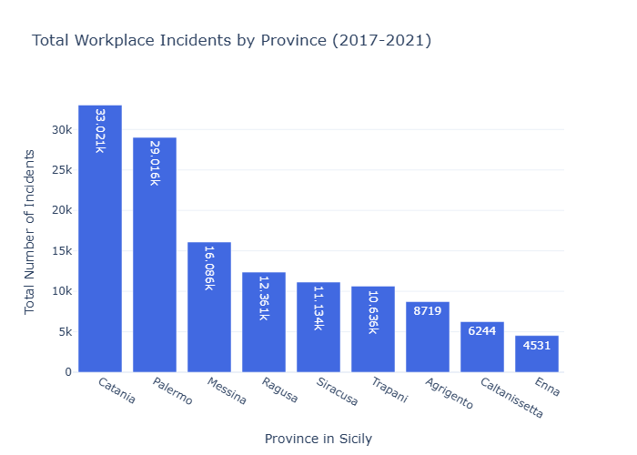
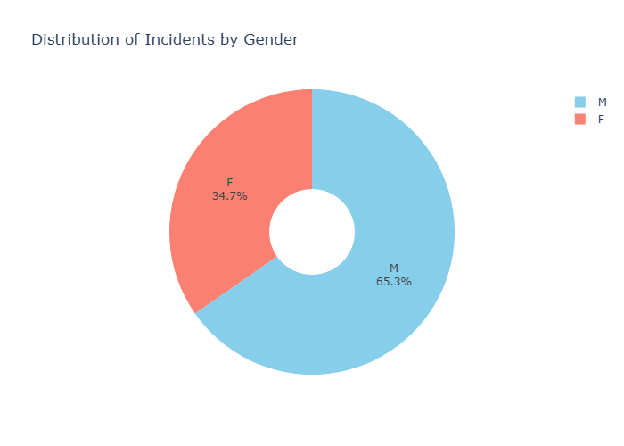

# italian-workplace-safety-analysis
# Workplace Safety in Sicily: A Data Analysis and Knowledge Graph Project


This project provides a comprehensive analysis of workplace incident data in Sicily from 2017 to 2021. It features a complete data engineering pipeline, from raw data ingestion and cleaning to the creation of a sophisticated RDF Knowledge Graph and insightful interactive visualizations.

---

## 🚀 Key Features

This project demonstrates a range of data engineering and analysis skills:

* **Full Data Pipeline:** End-to-end processing from multiple raw `.csv` and `.xls` files to a final, clean, and enriched dataset.
* **Semantic Data Modeling:** Development of a custom **RDFS ontology** to model the domain. The final output is a 5-star Linked Open Data **Knowledge Graph** in Turtle (`.ttl`) format.
* **Data Cleaning & Enrichment:** Advanced data cleaning techniques, strategic handling of missing values, and enrichment of the main dataset by joining it with multiple lookup tables.
* **SPARQL Queries:** The generated Knowledge Graph is fully queryable, and the project includes several example SPARQL queries to extract complex insights and perform aggregations.
* **Interactive Visualizations:** The final analysis is presented through clear and interactive charts using Plotly, highlighting key findings.

---

## 🛠️ Tech Stack

* **Language:** Python
* **Data Manipulation:** Pandas
* **Semantic Web / RDF:** RDFLib
* **Data Visualization:** Plotly Express
* **Development Environment:** Jupyter Notebook / Python Script

---

## ⚙️ Getting Started

To run this project locally, follow these steps.

### Prerequisites

* Python 3.8 or higher
* pip package manager

### Installation & Execution

1.  **Clone the repository:**
    ```bash
    git clone [https://github.com/your-username/italian-workplace-safety-analysis.git](https://github.com/your-username/italian-workplace-safety-analysis.git)
    cd italian-workplace-safety-analysis
    ```

2.  **Create a `requirements.txt` file** in the project directory with the following content:
    ```
    pandas
    plotly
    rdflib
    tqdm
    openpyxl # Needed by pandas to read .xls files
    ```

3.  **Install the required libraries:**
    ```bash
    pip install -r requirements.txt
    ```

4.  **Run the analysis:**
    The entire pipeline is contained in the `main.py` script (or your Jupyter Notebook). To run it from the terminal:
    ```bash
    python main.py
    ```
    This will execute the full process: data loading, cleaning, ontology and knowledge graph generation, and will display the final charts.

---

## 📂 Project Structure

    .
    ├── data/                     # Contains all the raw .csv and .xls datasets
    ├── images/                   # Contains the exported visualization images
    ├── main.py                   # The main executable Python script for the entire pipeline
    ├── workplace_safety_ontology.ttl # The generated RDFS ontology file
    ├── workplace_safety_knowledge_graph.ttl # The final, populated Knowledge Graph
    └── README.md                 # This file

---

## 📊 Key Insights & Visualizations

The analysis revealed several key insights, most notably the significant disparity in incident counts among provinces.

### Incidents per Province
The bar chart clearly shows that the province of Catania has a substantially higher number of reported incidents compared to all other provinces in Sicily during the period.



### Gender Distribution
The data shows a significant imbalance in reported incidents, with a large majority involving males.



---

## 📜 License

This project is licensed under the MIT License. See the `LICENSE` file for details.
